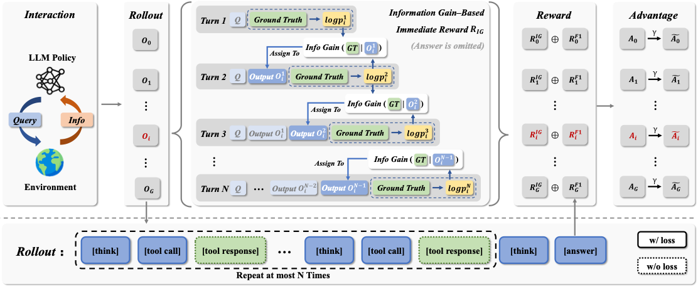
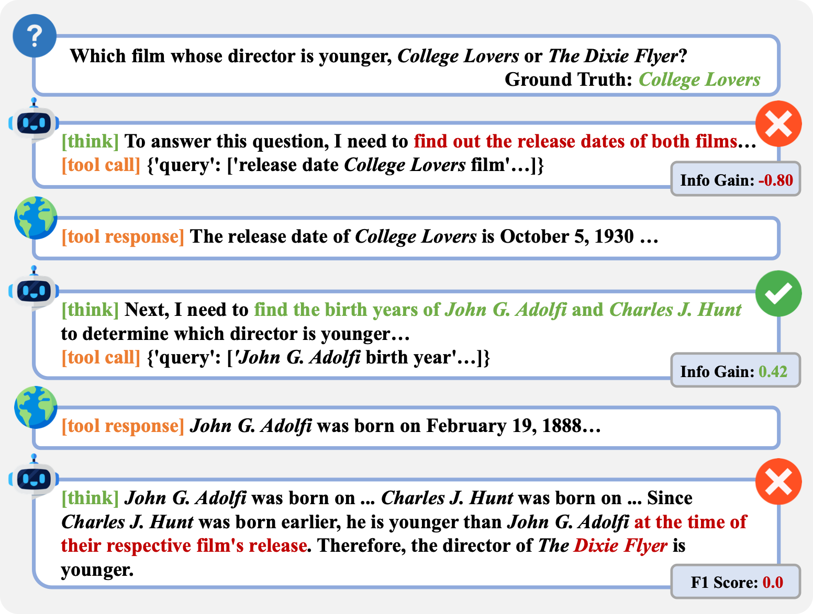

# Information Gain-based Policy Optimization: A Simple and Effective Approach for Multi-Turn LLM Agents


## 📝 Introduction

we propose Information
Gain-based Policy Optimization (IGPO), a simple yet effective RL framework
that provides dense and intrinsic supervision for multi-turn agent training. IGPO
models each interaction turn as an incremental process of acquiring information
about the ground truth, and defines turn-level rewards as the marginal increase in
the policy’s probability of producing the correct answer. These intrinsic rewards
are combined with outcome-level supervision to form dense reward trajectories.


<p align="center">
  
</p>


## 🏆 Performance
### Main Result
we conduct extensive experiments on both in-domain and
out-of-domain benchmarks with search agents. Results show that IGPO consistently outperforms strong baselines, delivering substantial gains in both answer accuracy and sample efficiency.


<p align="center">
  
</p>


### Case Study
Case study showing a scenario where the final answer is incorrect but contains a single correct retrieval turn. IGPO provides an encouragement reward to the correct turn, effectively enabling fine-grained credit assignment.

<p align="center">
  
</p>


## 🚀 Get Started

### Package Installation

To begin using this repo, you need to install the required dependencies. You can do this by running the following command:

```bash
git clone https://anonymous.4open.science/r/IGPO-BAC8.git
conda create -n IGPO python=3.10 
conda activate IGPO
cd IGPO
pip3 install torch==2.4.0 --index-url https://download.pytorch.org/whl/cu124
pip3 install flash-attn --no-build-isolation
pip3 install -e .
pip3 install -r requirements.txt
```


### Run backend handler

Running the following command to launch the server handler:

1. Modify ```serper_api_key``` or ```azure_bing_search_subscription_key``` & ```search_engine``` in ```./scrl/handler/config.yaml```
2. Add  ```qwen-plus``` api key in ```./scrl/handler/server_handler.py```

```python
client = OpenAI(
    api_key="sk-xxx",
    base_url="xxxx"
)
```

3. Start server handler:

```bash
 python ./scrl/handler/server_handler.py
```

After launching all server handlers, you can replace ```server_url_list``` in ```./scrl/handler/config.yaml``` in your training host node and then run:

```bash
 python ./scrl/handler/handler.py
```

### 🏋️‍♂️ Training the model
Step: Set the Prompt

The system prompt for our model can be found in:

```bash
 ./scrl/handler/config.yaml (line 25)
```


Step 2: Start Training
Once you’ve set the reward function, launch training with:

```bash
 bash policy_optimization.sh
```

### Evaluate

Using the following command to generate rollout:

```bash
 bash evaluate.sh
```

You can find the rollout file in: ```./outputs/{project_name}/{experiment_name}/rollout/rollout_step_0.json```
You can rename and copy it into ```./evaluate/{experiment_name}_result.json```

Then, run the following command:

```bash
 python ./evaluate/cacluate_metrics.py {experiment_name}
```

You can check the score in ```./evaluate/{experiment_name}_score.json```

## 🙏 Acknowledgement 

IGPO is inspired by [Deepseek-R1](https://github.com/deepseek-ai/DeepSeek-R1), with its implementation built upon [veRL](https://github.com/volcengine/verl), [Search-r1](https://github.com/PeterGriffinJin/Search-R1), and [DeepResearcher](https://github.com/GAIR-NLP/DeepResearcher). We are grateful to the teams behind these projects for their significant contributions to open-source research and development.

## Citation
If you find our code or work useful for your research, please cite our work.
```
@article{wang2025informationg,
      title={Information Gain-based Policy Optimization: A Simple and Effective Approach for Multi-Turn LLM Agents}, 
      author={Wang, Guoqing and Dai, Sunhao and Ye, Guangze and Gan, Zeyu and Yao, Wei and Deng, Yong and Wu, Xiaofeng and Ying, Zhenzhe},
      journal={arXiv preprint arXiv:2510.14967},
      year={2025}
}
```

